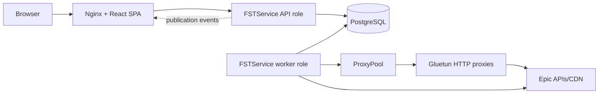

# System overview

Fortnite Festival Score Tracker preserves leaderboard history that Epic resets
between seasons. It continuously acquires Epic data, builds derived views,
publishes a consistent PostgreSQL generation, serves that generation through an
ASP.NET Core API, and renders it in a React application.

The direct Worker-to-Epic path is used when no proxy pool is configured. When
the pool is configured, only proxy-aware Epic leaderboard/history clients use
it; API serving, PostgreSQL, health checks, and browser traffic remain outside
the VPN path.

## Components

| Component | Responsibility | Durable state |
|---|---|---|
| `FortniteFestivalWeb/` | Browser routes, interaction, API queries, publication refresh, static deployment | Browser storage and caches only |
| `FSTService` API role | HTTP/WebSocket endpoints, auth, rate limiting, read gates, cache and publication contracts | PostgreSQL |
| `FSTService` worker role | Epic authentication, scraping, post-processing, rankings, rivals, publication, recovery | PostgreSQL plus bounded same-drive artifacts |
| `FortniteFestival.Core/` | Shared .NET domain, Epic integration, song/catalog and legacy compatibility code | No independent service |
| `packages/` | Shared TypeScript domain/API types, design tokens, and UI utilities | Source packages only |
| PostgreSQL 17 | Authoritative service state, historical scores, projections, publication metadata, caches, queues | FST production drive |
| Gluetun containers | Independent VPN exits exposed as HTTP/control endpoints to the worker | Provider-managed tunnel state |

## Runtime roles

One `FSTService` binary supports several hosting modes. Production normally
uses the same image twice:

- `fstservice`: frontend/API role with scheduled scrape mutation disabled;
- `fstworker`: full worker role with scraper, worker heartbeat, registration
  backfill, and band-rank-history services.

Additional registration-only, read-only rollout, one-shot, setup, and
maintenance modes are described in
[`reference/cli.md`](../reference/cli.md).

## Data ownership

PostgreSQL is the service source of truth. `InstrumentDatabase` instances are
logical per-instrument views over shared PostgreSQL relations, not independent
SQLite shards. The worker owns candidate writes and publication. The API owns
public reads and never exposes an incomplete candidate as the current
generation.

See:

- [Scrape and publication flow](data-publication-flow.md)
- [Data storage](data-storage.md)
- [Deployment topology](../operations/deployment.md)
- [VPN proxy pool](../operations/vpn-proxy-pool.md)
