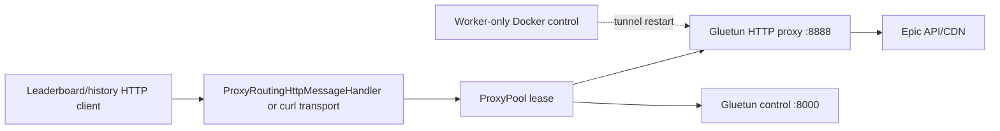

# VPN proxy pool

## Why it exists

High-volume Epic leaderboard/history collection can encounter exit-IP-scoped
CDN blocks, rate limits, and unhealthy tunnels. A single exit can therefore
stall a scrape even when the request and credentials are valid.

FST uses independent Gluetun containers as HTTP proxy endpoints so it can:

- distribute requests across exit IPs;
- cool down only the affected exit after a CDN block;
- retry on another healthy endpoint;
- pace and bound concurrency per endpoint;
- restart a broken tunnel without restarting the worker;
- keep PostgreSQL, API serving, browser traffic, and unrelated HTTP clients off
  the VPN path.

This is traffic isolation and resilience, not anonymity for the whole stack.

## Request path

`Program.cs` installs proxy routing only for proxy-aware Epic clients. Auth,
database, web, health, and general service traffic use normal networking.

## Endpoint contract

The worker receives four index-aligned arrays:

- `Scraper:ProxyUrls`
- `Scraper:ControlUrls`
- `Scraper:VpnProviders`
- `Scraper:ContainerNames`

When `ExpectedProxyEndpointCount` is nonzero, each array must contain exactly
that many non-empty entries. Proxy and control hostnames must match the aligned
container and expected internal ports. Container names must be unique.

No direct endpoint is appended to a configured pool. An empty pool uses the
normal direct HTTP handler.

## Selection and failure handling

The pool supports active/standby rotation or least-in-flight selection.
Per-endpoint request starts, concurrency, connection reuse, cooldown, and
rotation are configurable.

On a CDN block:

1. mark and cool the endpoint immediately;
2. retry through another available proxy;
3. if every proxy is cooling down, wait for pool recovery;
4. pause globally only when the request was not associated with a known proxy.

Transport, timeout, rate-limit, and server failures use separate thresholds.
Curl can be the primary proxied transport so production behavior matches proxy
qualification canaries. Same-drive scratch is required for curl bodies.

## Self-heal boundary

Repeated tunnel-level transport failures can restart the aligned container.
CDN blocks alone cool/fail over; they do not prove a tunnel is broken.

Only `fstworker` receives `/var/run/docker.sock`. API/frontend roles use
`DisabledProxyContainerRecycler`, which rejects restart requests. The recycler
normally restarts a container without rewriting provider selectors; legacy
recreate/city-selection support exists for provider-specific workflows.

The recycler cannot repair boot before `fstworker` starts. The production
startup contract therefore has a separate host-side boundary:

1. the production-owned orchestrator starts core services and the exact
   effective proxies with a plain idempotent `up -d --no-deps`;
2. `tools/fst-worker-compose-guard.sh --recover-start` takes the shared
   Compose-directory worker-start/recreate lock and validates the merged
   continuous config with `--profile worker`, then validates the `worker`
   profile and `on-failure:5` policy;
3. it requires healthy PostgreSQL/API readiness, a stopped worker, an idle
   update, and unfrozen public reads;
4. it waits up to 360 seconds for initial effective-set convergence;
5. it may force-recreate only the still-unhealthy effective services, each once
   and no more than three total by default, then waits another 360 seconds;
6. it runs the existing DNS, control, HTTP-proxy, and distinct-egress probes
   before recreating only `fstworker`;
7. it requires worker container health plus a new, fresh operational heartbeat;
8. one 1,800-second default total deadline caps the complete recovery path.

Non-effective canonical services are ignored, healthy services are not
recreated, and no spare is promoted automatically. A failure starts no worker.
After worker start, cleanup stops it only while the operational state remains
idle and unfrozen; active/frozen work remains running for the no-progress
watchdog. Core service containers are never restarted by this path.
Proxy-only force-recreate commands name only the unhealthy effective services
and do not enable or target the worker profile.

## Compose layouts

| Layer | Purpose |
|---|---|
| Root template | Four core services; proxy examples inactive |
| `deploy/` template | Four optional AirVPN Gluetun endpoints |
| Production base | Core services plus a larger provider pool |
| Standard PIA overlay | 30 canonical services, currently 25 effective aligned endpoints |
| Optional expansion overlays | Additional endpoints/recovery variants owned by the production project |

The PIA guard requires the overlay filename `docker-compose.pia-30.yml`,
canonical count 30, effective count no greater than 30, exact service names,
aligned arrays, PIA provider labels, and matching worker dependencies. The
optional 80-endpoint expansion is a separate production-owned topology and is
not the standard guard target.

Effective PIA services must not resolve a nonempty `OPENVPN_ENDPOINT_IP`.
Hostname/region selection remains supported; static resolved IP pins are
rejected because they can preserve a dead tunnel across boot.
Canonical effective-service membership and this pin rejection apply to
`--check`, run-once checks, and both existing recreate actions as deliberate
safety tightening. Every action also requires the guard-only `worker` profile;
continuous actions require `on-failure:5`, while run-once actions require
`restart: no`.

## Safety and secrecy

- Never commit VPN credentials, provider account data, private endpoints, or
  resolved `.env` values.
- Do not route the entire worker/container through one VPN network namespace;
  the design depends on per-request endpoint selection.
- Do not give the API service Docker control.
- Validate effective Compose configuration and key names without printing
  values.
- Treat configured service counts separately from observed running-container
  state.
- Keep candidate throughput profiles, including `candidate-1600-64-8`, confined
  to guarded run-once evaluation. Continuous recovery accepts the approved
  `baseline-up-to-800-32-4` profile.
