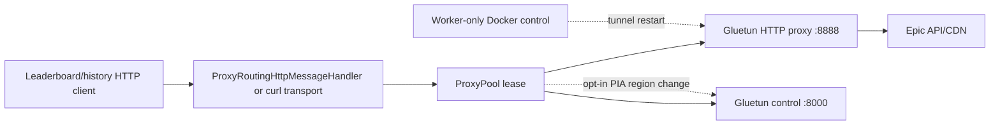

# VPN proxy pool

## Why it exists

High-volume Epic leaderboard/history collection can encounter exit-IP-scoped
CDN blocks, rate limits, and unhealthy tunnels. A single exit can therefore
stall a scrape even when the request and credentials are valid.

FST uses independent Gluetun containers as HTTP proxy endpoints so it can:

- distribute requests across exit IPs;
- cool down only the affected exit after a CDN block;
- retry on another healthy endpoint;
- pace and bound concurrency per endpoint;
- restart a broken tunnel without restarting the worker;
- optionally change a rate-limited PIA exit to a separately qualified region
  without changing its proxy hostname or increasing Epic requests;
- keep PostgreSQL, API serving, browser traffic, and unrelated HTTP clients off
  the VPN path.

This is traffic isolation and resilience, not anonymity for the whole stack.

## Request path

`Program.cs` installs proxy routing only for proxy-aware Epic clients. Auth,
database, web, health, and general service traffic use normal networking.

## Endpoint contract

The worker receives four index-aligned arrays:

- `Scraper:ProxyUrls`
- `Scraper:ControlUrls`
- `Scraper:VpnProviders`
- `Scraper:ContainerNames`

When `ExpectedProxyEndpointCount` is nonzero, each array must contain exactly
that many non-empty entries. Proxy and control hostnames must match the aligned
container and expected internal ports. Container names must be unique.

No direct endpoint is appended to a configured pool. An empty pool uses the
normal direct HTTP handler.

## Selection and failure handling

The pool supports active/standby rotation or least-in-flight selection.
Per-endpoint request starts, concurrency, connection reuse, cooldown, and
rotation are configurable.

On a CDN block:

1. mark and cool the endpoint immediately;
2. retry through another available proxy;
3. if every proxy is cooling down, wait for pool recovery;
4. pause globally only when the request was not associated with a known proxy.

Transport, timeout, and server failures use separate thresholds; rate limits
are handled per response.
Curl can be the primary proxied transport so production behavior matches proxy
qualification canaries. Same-drive scratch is required for curl bodies.

Each HTTP 429 immediately cools the endpoint that returned it; it does not wait
for the ordinary HTTP-failure threshold. The cooldown is the greater of the
configured base cooldown and a positive `Retry-After` value (delta-seconds or
HTTP-date), and an already later cooldown is retained. Success reports reset
failure counters but never shorten an active cooldown. Retry waits are
cancellation-aware and no additional wire send is issued while all endpoints
are cooling.

### Optional PIA egress refresh (region rotation)

`Scraper:ProxyRegionRotationEnabled` is **off by default**. The worker may
enable it only with a complete aligned PIA pool, the existing curl transport
and same-data-directory scratch, and either an explicit list of
operator-qualified PIA regions or reconnect-in-place. It does not turn on
legacy active/standby proxy selection.

#### Why it exists: per-IP edge rate limits

Since September 2026 Epic's leaderboard edge returns HTTP 429 with an HTML
"Rate limited — you are visiting our service too frequently" page (not the
JSON `errors.com.epicgames.common.throttled` body). The limit is per egress IP
and behaves like a token bucket: a fresh egress served roughly 50–150
requests before its first 429, while an exhausted egress returned 429 within
about one second of every 45-second cooldown, leaking only about 0.3
successful requests per second. With 24 static exits that capped leaderboard
acquisition near 7–10 successful requests per second, with each exit cooled
about 95% of the time. Changing the region label alone does not help; what
matters is a **new, rested egress IP**.

#### Trigger and scheduling

After the configured count of consecutive HTTP 429s for one exit (production
uses 1), the pool records that exit's known egress as rate-limited, holds the
exit out of selection immediately, and schedules one refresh. An optional
request budget can refresh an exit proactively after a number of successes on
one egress. A per-exit minimum interval, an optional global start spacing, and
a bounded number of concurrent refreshes (never the same exit twice) prevent
mass reconnection. Successful requests reset the 429 trigger count. CDN blocks
keep their existing separate handling. When container self-heal would restart
an exit after tunnel-level transport failures, an enabled refresh is tried
first (a restart returns to the static region, which may itself be dead); a
refresh that cannot reach the control API makes the next restartable failure
use the existing container restart.

#### Refresh

The worker waits up to `ProxyRegionRotationDrainSeconds` for in-flight leases
to finish, then proceeds; every lease is stamped with a tunnel generation, and
success/failure/429 reports from an older generation are ignored so a request
cut by the reconnect cannot cool, burn, or restart the replacement tunnel.

It first probes the exit's real current egress (the census value may be
missing or stale) and, for a 429 trigger, records that egress as rate-limited.
It reads the Gluetun control settings **without logging the response** (which
can contain VPN credentials; only a short sanitized outcome scalar is ever
logged) and requires a single-region OpenVPN PIA selector
with no competing city/name/country/hostname filters. Candidates are, in
order: an in-place reconnect of the current region (`PUT /v1/vpn/status`
stopped, then running; Gluetun's random selection connects another server),
followed by the qualified region list rotated per exit and attempt (`PUT
/v1/vpn/settings` with only a region selector). A healthy PIA reconnect
produces real egress in about 3 seconds; a dead server fails its OpenVPN TLS
handshake after about 20 seconds, so each candidate has a short verification
window and the rotator moves to the next candidate instead of waiting.

A candidate is accepted only when a real curl IP-echo probe through that exit's
proxy (the existing benign endpoint, **not Epic**) returns an egress that:

- differs from the exit's previous egress;
- is not another exit's known or pending egress (claimed atomically by the
  pool, so concurrent refreshes cannot land on the same egress);
- has not returned HTTP 429 within `ProxyRegionRotationBurnedEgressTtlSeconds`;

and the control API reports the candidate region and Docker reports the
container healthy. A reachable but unacceptable egress moves to the next
candidate after a short settle. Neither a `running` control response, Docker
`healthy`, nor cached Gluetun public-IP metadata alone qualifies a tunnel.

A rotated exit is immediately selectable (its old cooldown belonged to the
spent egress); an explicit `Retry-After` is still honored. While refresh is
enabled, an HTML edge 429 on a proxied request is handled per exit and is not
reported to the adaptive concurrency limiter; otherwise the expected ~3% of
per-IP 429s pins global DOP at its floor. JSON 429s (which may be account
scoped) still reduce DOP.

#### Restoration and quarantine

When every candidate fails or the overall deadline expires, the worker first
keeps the current tunnel if it still has real, peer-distinct egress (a
rate-limited egress is acceptable here; candidates are often rejected only for
that reason), because the prior or static region may itself be failing TLS.
Otherwise it returns the exit to its prior region (or reconnects it) and
verifies the same way. If control rollback fails,
it restarts only that proxy container, restoring its static Compose selector,
and verifies again. If recovery cannot be verified, that exit is quarantined
until operator intervention or a guarded worker restart. Cancellation stops
queued waits and attempts restoration after a tunnel change. Gluetun control
settings are ephemeral: Docker/container restart returns a refreshed exit to
the production-owned static Compose region. The host-side boot guard
requalifies every effective exit before starting the worker. API/web roles
cannot enable refreshes or receive Docker control.

#### Egress census and telemetry

Because the pool no longer probes every peer on each refresh, it keeps each
exit's egress current with a background census: at most one IP-echo probe per
exit every five minutes, two at a time, skipping refreshing or quarantined
exits. An out-of-band change (for example Gluetun's own health restart) starts
a new generation; two exits sharing an egress schedule a refresh.

Once a minute the pool logs `Proxy pool summary` with successful and
rate-limited responses (and how many 429s were HTML edge pages), stale
reports, refreshes scheduled/started/rotated/restored/deferred/unsafe, mean
refresh duration, mean successes per retired egress, and exit states
(selectable, cooling, refreshing, quarantined, known egress, rate-limited
egress set size). Use these denominators, not raw 429 counts, to judge
throughput changes.

#### Qualifying regions

An allowlisted region is an **eligibility and safety boundary**. Qualify it on
a non-effective spare first with repeated control-API region changes and
reconnects plus real IP-echo egress, never Epic traffic. On 2026-09-26 spare
trials, US New York, US Denver, CA Montreal, US Florida, US California,
Netherlands, and CA Vancouver reconnected in about 1–9 seconds on every
attempt. US Texas, US Seattle, US Chicago, US Atlanta, US Silicon Valley, US
East Streaming Optimized, UK London, DE Frankfurt, and US Washington DC failed
every OpenVPN TLS handshake; CA Toronto, US Ohio, US Salt Lake City,
Switzerland, and France were intermittent. Requalify before relying on these
lists; PIA server health changes.

## Self-heal boundary

Repeated tunnel-level transport failures can restart the aligned container
(or, with the optional egress refresh enabled, first reconnect it through the
control API). CDN blocks alone cool/fail over; they do not prove a tunnel is
broken.

Only `fstworker` receives `/var/run/docker.sock`. API/frontend roles use
`DisabledProxyContainerRecycler`, which rejects restart requests. The recycler
normally restarts a container without rewriting provider selectors; legacy
recreate/city-selection support exists for provider-specific workflows.
The PIA-only control API change above never writes `SERVER_CITIES` or
`SERVER_NAMES`, so it does not reuse AirVPN's legacy Docker recreate path.

The recycler cannot repair boot before `fstworker` starts. The production
startup contract therefore has a separate host-side boundary:

1. the production-owned orchestrator starts core services and the exact
   effective proxies with a plain idempotent `up -d --no-deps`;
2. `tools/fst-worker-compose-guard.sh --recover-start` takes the shared
   Compose-directory worker-start/recreate lock and validates the merged
   continuous config with `--profile worker`, then validates the `worker`
   profile and `on-failure:5` policy;
3. it requires healthy PostgreSQL/API readiness, a stopped worker, an idle
   update, and unfrozen public reads;
4. it waits up to 360 seconds for initial effective-set convergence;
5. it may force-recreate only the still-unhealthy effective services, each once
   and no more than three total by default, then waits another 360 seconds;
6. it runs the existing DNS, control, HTTP-proxy, and distinct-egress probes
   before recreating only `fstworker`;
7. it requires worker container health plus a new, fresh operational heartbeat;
8. one 1,800-second default total deadline caps the complete recovery path.

Non-effective canonical services are ignored, healthy services are not
recreated, and no spare is promoted automatically. A failure starts no worker.
After worker start, cleanup stops it only while the operational state remains
idle and unfrozen; active/frozen work remains running for the no-progress
watchdog. Core service containers are never restarted by this path.
Proxy-only force-recreate commands name only the unhealthy effective services
and do not enable or target the worker profile.

## Compose layouts

| Layer | Purpose |
|---|---|
| Root template | Four core services; proxy examples inactive |
| `deploy/` template | Four optional AirVPN Gluetun endpoints |
| Production base | Core services plus a larger provider pool |
| Standard PIA overlay | 30 canonical services, 24 effective aligned endpoints as of 2026-09-26 |
| Optional expansion overlays | Additional endpoints/recovery variants owned by the production project |

The PIA guard requires the overlay filename `docker-compose.pia-30.yml`,
canonical count 30, effective count no greater than 30, exact service names,
aligned arrays, PIA provider labels, and matching worker dependencies. The
optional 80-endpoint expansion is a separate production-owned topology and is
not the standard guard target.

The operator-approved September 2026 handoff replaced TLS-failing
`pia-gluetun-4` with the previously qualified Vancouver `pia-gluetun-3`,
excluded TLS-failing `pia-gluetun-19`, and retained healthy
`pia-gluetun-20`. The production-owned `.env` count, overlay default, four
indexed arrays, and worker dependencies now agree at 24. The full worker
guard verified 24 healthy, distinct exits and unchanged `800/32/4`
aggregate/per-exit/concurrency ceilings before stopping the slow candidate
and again before the guarded worker-only restart. Scrape 1427 failed through
the exact interrupted-acquisition and official failure-isolation paths;
published 1424 remained intact and reads were unfrozen before the new worker
started. Vancouver's tunnel and egress qualification is not evidence that
its city avoids Epic 429s; compare bounded official-scrape outcomes before
claiming regional relief.

On 2026-09-26 the owner-authorized egress-refresh release (`fac42684`) stopped
scrape 1430 through the same interrupted-acquisition normalization and
official failure-isolation paths (published 1424 preserved) and started scrape
1431. The production worker env enables refresh with the seven qualified
regions above, reconnect-in-place, a one-429 trigger, 10-second per-exit
interval, 1-second global spacing, eight concurrent refreshes, four
12-second attempts within 90 seconds, a 300-second rate-limited egress window,
and a 5-second drain. Against the prior worker's last five minutes (about 390
successful leaderboard requests and 6–7 progress units per minute), the first
twelve minutes of 1431 sustained about 3,700–6,000 successful requests and
50–60 units per minute, with 3–4% HTTP 429s, refreshes averaging 6–10
seconds, about 90–100 successes per retired egress, no quarantines, and no
retry exhaustion.

Effective PIA services must not resolve a nonempty `OPENVPN_ENDPOINT_IP`.
Hostname/region selection remains supported; static resolved IP pins are
rejected because they can preserve a dead tunnel across boot.
Canonical effective-service membership and this pin rejection apply to
`--check`, run-once checks, and both existing recreate actions as deliberate
safety tightening. Every action also requires the guard-only `worker` profile;
continuous actions require `on-failure:5`, while run-once actions require
`restart: no`.

## Safety and secrecy

- Never commit VPN credentials, provider account data, private endpoints, or
  resolved `.env` values.
- Do not route the entire worker/container through one VPN network namespace;
  the design depends on per-request endpoint selection.
- Do not give the API service Docker control.
- Validate effective Compose configuration and key names without printing
  values.
- Treat configured service counts separately from observed running-container
  state.
- Keep candidate throughput profiles, including `candidate-1600-64-8`, confined
  to guarded run-once evaluation. Continuous recovery accepts the approved
  `baseline-up-to-800-32-4` profile.
