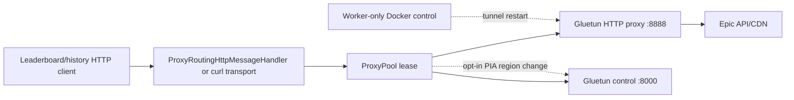

# VPN proxy pool

## Why it exists

High-volume Epic leaderboard/history collection can encounter exit-IP-scoped
CDN blocks, rate limits, and unhealthy tunnels. A single exit can therefore
stall a scrape even when the request and credentials are valid.

FST uses independent Gluetun containers as HTTP proxy endpoints so it can:

- distribute requests across exit IPs;
- cool down only the affected exit after a CDN block;
- retry on another healthy endpoint;
- pace and bound concurrency per endpoint;
- restart a broken tunnel without restarting the worker;
- optionally change a rate-limited PIA exit to a separately qualified region
  without changing its proxy hostname or increasing Epic requests;
- keep PostgreSQL, API serving, browser traffic, and unrelated HTTP clients off
  the VPN path.

This is traffic isolation and resilience, not anonymity for the whole stack.

## Request path

```mermaid
flowchart LR
    EpicClient[Leaderboard/history HTTP client]
      --> Handler[ProxyRoutingHttpMessageHandler or curl transport]
      --> Pool[ProxyPool lease]
      --> Gluetun[Gluetun HTTP proxy :8888]
      --> Epic[Epic API/CDN]
    Pool --> Control[Gluetun control :8000]
    Worker[Worker-only Docker control] -. tunnel restart .-> Gluetun
    Pool -. opt-in PIA region change .-> Control
```

`Program.cs` installs proxy routing only for proxy-aware Epic clients. Auth,
database, web, health, and general service traffic use normal networking.

## Endpoint contract

The worker receives four index-aligned arrays:

- `Scraper:ProxyUrls`
- `Scraper:ControlUrls`
- `Scraper:VpnProviders`
- `Scraper:ContainerNames`

When `ExpectedProxyEndpointCount` is nonzero, each array must contain exactly
that many non-empty entries. Proxy and control hostnames must match the aligned
container and expected internal ports. Container names must be unique.

No direct endpoint is appended to a configured pool. An empty pool uses the
normal direct HTTP handler.

## Selection and failure handling

The pool supports active/standby rotation or least-in-flight selection.
Per-endpoint request starts, concurrency, connection reuse, cooldown, and
rotation are configurable.

On a CDN block:

1. mark and cool the endpoint immediately;
2. retry through another available proxy;
3. if every proxy is cooling down, wait for pool recovery;
4. pause globally only when the request was not associated with a known proxy.

Transport, timeout, and server failures use separate thresholds; rate limits
are handled per response.
Curl can be the primary proxied transport so production behavior matches proxy
qualification canaries. Same-drive scratch is required for curl bodies.

Each HTTP 429 immediately cools the endpoint that returned it; it does not wait
for the ordinary HTTP-failure threshold. The cooldown is the greater of the
configured base cooldown and a positive `Retry-After` value (delta-seconds or
HTTP-date), and an already later cooldown is retained. Success reports reset
failure counters but never shorten an active cooldown. Retry waits are
cancellation-aware and no additional wire send is issued while all endpoints
are cooling.

### Optional PIA egress refresh (region rotation)

`Scraper:ProxyRegionRotationEnabled` is **off by default**. The worker may
enable it only with a complete aligned PIA pool, the existing curl transport
and same-data-directory scratch, and either an explicit list of
operator-qualified PIA regions or reconnect-in-place. It does not turn on
legacy active/standby proxy selection.

#### Why it exists: per-IP edge rate limits

Since September 2026 Epic's leaderboard edge returns HTTP 429 with an HTML
"Rate limited — you are visiting our service too frequently" page (not the
JSON `errors.com.epicgames.common.throttled` body). The limit is per egress IP
and behaves like a token bucket: a fresh egress served roughly 50–150
requests before its first 429, while an exhausted egress returned 429 within
about one second of every 45-second cooldown, leaking only about 0.3
successful requests per second. With 24 static exits that capped leaderboard
acquisition near 7–10 successful requests per second, with each exit cooled
about 95% of the time. Changing the region label alone does not help; what
matters is a **new, rested egress IP**.

#### Trigger and scheduling

After the configured count of consecutive HTTP 429s for one exit (production
uses 1), the pool records that exit's known egress as rate-limited, holds the
exit out of selection immediately, and schedules one refresh. An optional
request budget can refresh an exit proactively after a number of successes on
one egress. A per-exit minimum interval, an optional global start spacing, and
a bounded number of concurrent refreshes (never the same exit twice) prevent
mass reconnection. Successful requests reset the 429 trigger count. CDN blocks
keep their existing separate handling. When container self-heal would restart
an exit after tunnel-level transport failures, an enabled refresh is tried
first (a restart returns to the static region, which may itself be dead); a
refresh that cannot reach the control API makes the next restartable failure
use the existing container restart.

#### Refresh

The worker waits up to `ProxyRegionRotationDrainSeconds` for in-flight leases
to finish, then proceeds; every lease is stamped with a tunnel generation, and
success/failure/429 reports from an older generation are ignored so a request
cut by the reconnect cannot cool, burn, or restart the replacement tunnel.

It first probes the exit's real current egress (the census value may be
missing or stale) and, for a 429 trigger, records that egress as rate-limited.
It reads the Gluetun control settings **without logging the response** (which
can contain VPN credentials; only a short sanitized outcome scalar is ever
logged) and requires a single-region OpenVPN PIA selector
with no competing city/name/country/hostname filters. Candidates are, in
order: an in-place reconnect of the current region (`PUT /v1/vpn/status`
stopped, then running; Gluetun's random selection connects another server),
followed by the qualified region list rotated per exit and attempt (`PUT
/v1/vpn/settings` with only a region selector). A healthy PIA reconnect
produces real egress in about 3 seconds; a dead server fails its OpenVPN TLS
handshake after about 20 seconds, so each candidate has a short verification
window and the rotator moves to the next candidate instead of waiting.

A candidate is accepted only when a real curl IP-echo probe through that exit's
proxy (the existing benign endpoint, **not Epic**) returns an egress that:

- differs from the exit's previous egress;
- is not another exit's known or pending egress (claimed atomically by the
  pool, so concurrent refreshes cannot land on the same egress);
- has not returned HTTP 429 within `ProxyRegionRotationBurnedEgressTtlSeconds`;

and the control API reports the candidate region and Docker reports the
container healthy. A reachable but unacceptable egress moves to the next
candidate after a short settle. Neither a `running` control response, Docker
`healthy`, nor cached Gluetun public-IP metadata alone qualifies a tunnel.

#### Targeted server selection

A PIA exit's egress address is the address of the OpenVPN server it connected
to (verified on 2026-10-04 on live exits), and Gluetun's control API accepts
`server_selection.openvpn.endpoint_ip`: with a region selector it connects to
exactly that server, using the server's own name for TLS verification, in
about 3 seconds (8/8 on a disposable clone across two regions). `0.0.0.0`
clears the pin and restores random selection. Random reconnects, by contrast,
wasted most attempts in production: on scrape `1465` (40 exits) 6,489
successful refreshes needed about 15,000 more rejected or failed candidates
(5,065 still rate-limited, 1,930 peer duplicates, 1,096 unchanged), so a
refresh averaged about 10 seconds.

With `ProxyRegionRotationTargetEndpoints`, the pool keeps a catalog of known
server addresses per region, learned from verified refreshes and from new
candidate egress rejected only as rate-limited or peer-held (never from a
merely unchanged egress). Each attempt first reserves, as the exit's pending
egress, the least recently used catalog address in a qualified region that no
exit holds or claims, that is outside the rate-limited window, and that is not
backing off after a failed pin (10 minutes, doubling to 6 hours; a verified
use or a corrected region clears it). With
`ProxyRegionRotationTargetMinRestSeconds`, a target must also have been
unused for that long. Equally rested servers (for example never-used seeded
ones) are chosen in random order. The attempt pins the exit to that server
and verifies it exactly like any candidate. When nothing qualifies (for
example right after a worker start, before the catalog has learned
addresses), the attempt falls back to the random candidate list; on a pinned
exit (or after a pin request whose outcome is ambiguous) that fallback and the
restoration rollback clear the pin instead of reconnecting, because an
in-place reconnect would return to the same server. Restoration may still
keep a working pinned tunnel, which is the normal state after a targeted
refresh. Container restarts and the Compose selector never carry a pin, and
the guard's static `OPENVPN_ENDPOINT_IP` rejection is unchanged.

Learning alone keeps the catalog small, because Gluetun's random choice
reaches only part of each list. With
`ProxyRegionRotationSeedServerCatalog`, the worker also reads every exit
container's runtime server list through the Docker archive API (read-only;
the archive is buffered in memory, because Docker.DotNet's stream ends early
under `TarReader`) at startup and hourly, and adds qualified-region UDP
addresses it does not know yet; learned entries keep their verified region,
use time, and failure state. On 2026-10-04 the 50 lists plus the image list
held 4,222 distinct addresses in the eight qualified regions, and 24 of 24
randomly sampled ones connected when pinned on a disposable clone.

Live canaries on 2026-10-04 (50 exits, full leaderboard network windows):

| Scrapes | Refresh | Successful requests/min | Network window | Successes per retired egress | Refresh time |
|---|---|---:|---:|---:|---:|
| 1466–1467 | random | 6,011–6,323 | 104–109 min | ~100 | 10–12 s |
| 1468–1469 | targeted, learned catalog | 8,210–8,398 | 77–79 min | 83 | 4–6 s |
| 1470 | targeted, seeded catalog | 12,494 | 51 min | 103 | ~5 s |

With learning only, learned servers first had to leave the rate-limited
window (about five minutes), and per-minute throughput then oscillated
(about 3,500–12,800) because the learned catalog (about 450–600 servers)
cycled every five to seven minutes: a server reused after 300–450 seconds of
rest averaged about 76 successful requests against about 92 on first use. The
seeded catalog (4,222 servers) removed that limit: about 120 targeted
refreshes per minute, 0–6 failed pins per minute, no random reconnects,
restorations, or quarantines, about 36 of 50 exits selectable, and HTTP 429s
at 3.2%. Seeded scrape `1470` logged about 1,400 retried curl
`wrong version number` (TLS) errors through its exits, against about 300 per
learned-catalog scrape; none exhausted a retry budget.

A rotated exit is immediately selectable (its old cooldown belonged to the
spent egress); an explicit `Retry-After` is still honored. While refresh is
enabled, an HTML edge 429 on a proxied request is handled per exit and is not
reported to the adaptive concurrency limiter; otherwise the expected ~3% of
per-IP 429s pins global DOP at its floor. JSON 429s (which may be account
scoped) still reduce DOP.

Those per-exit edge 429s also have their own retry budget (12 retries, each
routed to another exit) before they consume the caller's status-retry budget.
Leaderboard pages allow four status attempts; at a 3–5% edge-429 rate, four
consecutive 429s on one page is roughly a once-per-scrape event across
hundreds of thousands of pages, and the scope-completeness gate then fails
the whole scrape (scrape `1438`: two pages, `incomplete=2`). JSON 429s and 5xx
responses keep the original budget.

#### Restoration and quarantine

When every candidate fails or the overall deadline expires, the worker first
keeps the current tunnel if it still has real, peer-distinct egress (a
rate-limited egress is acceptable here; candidates are often rejected only for
that reason), because the prior or static region may itself be failing TLS.
Otherwise it returns the exit to its prior region (or reconnects it) and
verifies the same way. Gluetun can hold a control request until an in-progress
OpenVPN handshake with a dead server gives up (about 20 seconds), so the
worker's control client allows 30 seconds and treats a control-call timeout as
a failed step (next candidate, then container restart), never as the overall
restoration deadline. If control rollback fails,
it restarts only that proxy container, restoring its static Compose selector,
and verifies again. Restoration never accepts another exit's egress; a small
static region can reconnect to a server a peer already uses, so a working but
duplicate restored tunnel is reconnected (up to six times) to another random
server instead of being declared unrecoverable. If recovery cannot be
verified, that exit is quarantined. With
`ProxyRegionRotationQuarantineRetrySeconds` set, the census loop retries a
full verified refresh after that delay (doubling per consecutive failure, up to
one hour) and the exit rejoins selection only after a `Rotated` or `Restored`
result; with the default `0` it stays quarantined until operator intervention
or a guarded worker restart. Cancellation stops
queued waits and attempts restoration after a tunnel change. Gluetun control
settings are ephemeral: Docker/container restart returns a refreshed exit to
the production-owned static Compose region. The host-side boot guard
requalifies every effective exit before starting the worker. API/web roles
cannot enable refreshes or receive Docker control.

#### Egress census and telemetry

Because the pool no longer probes every peer on each refresh, it keeps each
exit's egress current with a background census: at most one IP-echo probe per
exit every five minutes, two at a time, skipping refreshing or quarantined
exits. An out-of-band change (for example Gluetun's own health restart) starts
a new generation; two exits sharing an egress schedule a refresh.

Proxied curl sends start their per-attempt timeout only after an exit lease
is held (`Scraper:ProxyRequestTimeoutSeconds`, default the executor's 30
seconds). Waiting for an exit is pool back-pressure: before this, requests
queued behind 96 exit slots at DOP 200 timed out uniformly across songs and
pages, were retried, and counted as adaptive-limiter failures without ever
reaching an exit. A second per-minute line, `Proxy send latency`, reports send
and lease-wait p50/p90/p99/max milliseconds and genuine send timeouts.

Once a minute the pool logs `Proxy pool summary` with successful and
rate-limited responses (and how many 429s were HTML edge pages), stale
reports, refreshes scheduled/started/rotated/restored/deferred/unsafe, mean
refresh duration, mean successes per retired egress, targeted pins reserved
and failed, and exit states (selectable, cooling, refreshing, quarantined,
known egress, rate-limited egress set size, known catalog servers, and
currently targetable "rested" servers). Use these denominators, not raw 429
counts, to judge throughput changes.

#### Qualifying regions

An allowlisted region is an **eligibility and safety boundary**. Qualify it on
a non-effective spare first with repeated control-API region changes and
reconnects plus real IP-echo egress, never Epic traffic. On 2026-09-26 spare
trials, US New York, US Denver, CA Montreal, US Florida, US California,
Netherlands, and CA Vancouver reconnected in about 1–9 seconds on every
attempt. US Texas, US Seattle, US Chicago, US Atlanta, US Silicon Valley, US
East Streaming Optimized, UK London, DE Frankfurt, and US Washington DC failed
every OpenVPN TLS handshake; CA Toronto, US Ohio, US Salt Lake City,
Switzerland, and France were intermittent. Requalify before relying on these
lists; PIA server health changes.

On 2026-10-02 a disposable spare Gluetun clone (UDP, eight region changes
each, real IP-echo egress) qualified US East: 8/8 healthy reconnects with 5
distinct egress addresses; the embedded server list carries 6 US East servers
and 96 addresses, comparable to the existing regions (73-109). US Michigan and
CA Ontario reached healthy egress on only 2/8 attempts and US Ohio on 1/8, so
they stay excluded. Traceroutes and TCP probes from the host showed many large
PIA ranges failing at the ISP's first upstream hop (ICMP network-unreachable
or TCP timeouts) with no gateway block rule, so unreachable regions reflect the
path from this site rather than Gluetun's server list. Because throughput is
bounded by how many distinct, non-rate-limited egress addresses the refresh
can reach, each added qualified region widens that pool.

On 2026-10-04 disposable clones (ipify only) retested 42 regions with one
region change and three reconnects each. Bahamas, Venezuela, Ecuador,
Uruguay, Costa Rica, and Guatemala then passed 8/8 deeper trials and Peru
4/4; their 280 image-list addresses do not overlap the eight qualified
regions. Almost every other US and European region (including US Texas,
Washington DC, Chicago, Seattle, Atlanta, Houston, Virginia, UK London, and
DE Frankfurt) reached egress on 0–3 of 4 attempts. A region also has to exist
in **every** effective container's runtime server list: Gluetun's updater
(`UPDATER_PERIOD`) rewrites each container's list on its own schedule, and on
2026-10-04 only Bahamas among those Latin American regions was present in all
50 lists (the eight qualified regions were, with at least 43 addresses each).
A region change or pin to a region missing from a container's list fails on
that container.

The failures are not explained by Gluetun's embedded PIA server list. On
2026-09-27 the list shipped in the running Gluetun image was 52 days old and
kept none of US Las Vegas's 86 or CA Toronto's 74 addresses, but loading a
fresh list (the image's `update -providers "private internet access"` command
run on the host network, 536 servers) into a spare and restarting it did not
make US Las Vegas, CA Toronto, or Switzerland connect: OpenVPN TLS key
negotiation still failed. The in-tunnel updater also times out reaching PIA's
server list.

## Self-heal boundary

Repeated tunnel-level transport failures can restart the aligned container
(or, with the optional egress refresh enabled, first reconnect it through the
control API). CDN blocks alone cool/fail over; they do not prove a tunnel is
broken.

Only `fstworker` receives `/var/run/docker.sock`. API/frontend roles use
`DisabledProxyContainerRecycler`, which rejects restart requests (and returns
no server lists). Catalog seeding only reads Gluetun's server-list file
through the archive API; it never writes into a container. The recycler
normally restarts a container without rewriting provider selectors; legacy
recreate/city-selection support exists for provider-specific workflows.
Once a restart has requested the stop, it always finishes with a start on its
own bounded token, waiting for a canceled stop to settle first. Docker records
an API stop as explicit, so the `unless-stopped` policy never revives the
container. On 2026-10-02 a restoration deadline fired between stop and start
during scrape `1458`, and `pia-gluetun-14` stayed exited, while its quarantine
retries (control-API only) could not reach it, until an operator ran
`docker start`.
The PIA-only control API change above never writes `SERVER_CITIES` or
`SERVER_NAMES`, so it does not reuse AirVPN's legacy Docker recreate path.

The recycler cannot repair boot before `fstworker` starts. The production
startup contract therefore has a separate host-side boundary:

1. the production-owned orchestrator starts core services and the exact
   effective proxies with a plain idempotent `up -d --no-deps`;
2. `tools/fst-worker-compose-guard.sh --recover-start` takes the shared
   Compose-directory worker-start/recreate lock and validates the merged
   continuous config with `--profile worker`, then validates the `worker`
   profile and `on-failure:5` policy;
3. it requires healthy PostgreSQL/API readiness, a stopped worker, an idle
   update, and unfrozen public reads;
4. it waits up to 360 seconds for initial effective-set convergence;
5. it may force-recreate only the still-unhealthy effective services, each once
   and no more than three total by default, then waits another 360 seconds;
6. it runs the existing DNS, control, HTTP-proxy, and distinct-egress probes
   before recreating only `fstworker`;
7. it requires worker container health plus a new, fresh operational heartbeat;
8. one 1,800-second default total deadline caps the complete recovery path.

Non-effective canonical services are ignored, healthy services are not
recreated, and no spare is promoted automatically. A failure starts no worker.
After worker start, cleanup stops it only while the operational state remains
idle and unfrozen; active/frozen work remains running for the no-progress
watchdog. Core service containers are never restarted by this path.
Proxy-only force-recreate commands name only the unhealthy effective services
and do not enable or target the worker profile.

## Compose layouts

| Layer | Purpose |
|---|---|
| Root template | Four core services; proxy examples inactive |
| `deploy/` template | Four optional AirVPN Gluetun endpoints |
| Production base | Core services plus a larger provider pool |
| Standard PIA overlay | 60 canonical services and 50 effective aligned endpoints as of 2026-10-04 (30 effective on 2026-10-03, 24 on 2026-09-26) |
| Optional expansion overlays | Additional endpoints/recovery variants owned by the production project |

The PIA guard requires the overlay filename `docker-compose.pia-30.yml` (a
historical name), a canonical count `Scraper:CanonicalProxyServiceCount`
between 30 and 60 with exactly `pia-gluetun-1` through `pia-gluetun-N`
defined, an effective count no greater than the canonical count, exact service
names, aligned arrays, PIA provider labels, and matching worker dependencies.
Canonical services beyond the effective arrays are spares the worker does not
use; define and qualify new exits that way before adding them to the arrays.
The
optional 80-endpoint expansion is a separate production-owned topology and is
not the standard guard target.

The operator-approved September 2026 handoff replaced TLS-failing
`pia-gluetun-4` with the previously qualified Vancouver `pia-gluetun-3`,
excluded TLS-failing `pia-gluetun-19`, and retained healthy
`pia-gluetun-20`. The production-owned `.env` count, overlay default, four
indexed arrays, and worker dependencies now agree at 24. The full worker
guard verified 24 healthy, distinct exits and unchanged `800/32/4`
aggregate/per-exit/concurrency ceilings before stopping the slow candidate
and again before the guarded worker-only restart. Scrape 1427 failed through
the exact interrupted-acquisition and official failure-isolation paths;
published 1424 remained intact and reads were unfrozen before the new worker
started. Vancouver's tunnel and egress qualification is not evidence that
its city avoids Epic 429s; compare bounded official-scrape outcomes before
claiming regional relief.

On 2026-09-26 the owner-authorized egress-refresh release stopped scrape 1430
through the interrupted-acquisition normalization and official
failure-isolation paths (published 1424 preserved) and started scrape 1431 on
`fac42684`. Follow-up builds (`c18f0f48`, then `0e06e61e`) kept per-exit edge
429s out of the adaptive limiter, kept working tunnels during restoration, and
stopped misreading Gluetun control timeouts as the restoration deadline.
Candidates 1431 and 1433–1435 ended `abandoned_staging_cleanup` after their
workers could not record an interrupted attempt within the shutdown window
(see [Deployment](deployment.md)); publication pointers were unchanged
throughout. As of scrape `1470` (2026-10-04) the production worker env
enables refresh with the eight qualified regions above, reconnect-in-place,
a one-429 trigger, a 10-second per-exit interval, no global spacing, 25
concurrent refreshes, four 12-second attempts within 90 seconds, a
300-second rate-limited egress window, a 5-second drain, targeted server
selection, and catalog seeding (earlier: 1-second global spacing and twelve
concurrent refreshes).

Against the prior worker's last five minutes (about 390 successful
leaderboard requests and 6–7 progress units per minute), the refresh builds
sustained about 3,700–4,400 successful requests and 50–60 units per minute,
with 3–5% HTTP 429s (all HTML edge pages), refreshes averaging 6–9 seconds,
about 70–95 successes per retired egress, no retry exhaustion, and (on
`0e06e61e`) no quarantines. Remaining capacity is bounded by exit
availability: at any moment roughly 6–11 of 24 exits are refreshing, mostly
because about half of first candidates return an egress still inside the
rate-limited window.

#### Exit-count scaling (2026-10-03/04)

The operator approved testing more than 30 exits to find a throughput sweet
spot. Spares were defined and qualified first (`pia-gluetun-34` and
`pia-gluetun-50` looped on PIA `AUTH_FAILED` against one US California server
and were moved to other static regions). Full leaderboard network windows:

| Scrape | Effective exits | Global spacing / concurrent refreshes | Successful requests/min | Network window | Successful refreshes/min | Peer-duplicate rejections |
|---|---:|---|---:|---:|---:|---:|
| 1461–1463 | 30 | 1 s / 12 | 5,412–5,605 | 115–119 min | ~56 | ~375 |
| 1464 | 35 | 1 s / 14 | 5,263 | 123 min | ~53 | 1,007 |
| 1465 | 40 | 0 / 20 | 6,037 | 108 min | ~61 | 1,930 |
| 1466 | 50 | 0 / 25 | 6,011 | 109 min | ~59 | 4,648 |

Throughput is about 100 successful requests per retired egress times the
successful refresh rate. One-second global spacing capped refresh starts near
60 per minute, so 35 paced exits were slower than 30; removing the spacing at
40 exits gave about 8%. Beyond that, random reconnects could not find fresh
egress faster: successful refreshes stayed near 60 per minute while
selectable exits stayed near 18–20, refreshes lengthened (about 10 to 12
seconds), and peer duplicates grew. Gluetun's random choice is also
concentrated: over scrape `1466` each region's roughly 1,300 connections
reached only 21–30 of the 51–96 addresses in the image's server list. Each
container's runtime server list (refreshed by `UPDATER_PERIOD`) differs; one
from 2026-09-27 shared only 135 of its 775 qualified-region addresses with the
image's 658, and the scrape reached 1,046 distinct server addresses in total.
A pin works for an address absent from the container's own list (6/6), so a
learned catalog is valid for every exit. Exit containers stayed negligible:
50 Gluetun containers used about 2.3 GiB and about half of one CPU in total
during acquisition.

Effective PIA services must not resolve a nonempty `OPENVPN_ENDPOINT_IP`.
Hostname/region selection remains supported; static resolved IP pins are
rejected because they can preserve a dead tunnel across boot.
Canonical effective-service membership and this pin rejection apply to
`--check`, run-once checks, and both existing recreate actions as deliberate
safety tightening. Every action also requires the guard-only `worker` profile;
continuous actions require `on-failure:5`, while run-once actions require
`restart: no`.

## Safety and secrecy

- Never commit VPN credentials, provider account data, private endpoints, or
  resolved `.env` values.
- Do not route the entire worker/container through one VPN network namespace;
  the design depends on per-request endpoint selection.
- Do not give the API service Docker control.
- Validate effective Compose configuration and key names without printing
  values.
- Treat configured service counts separately from observed running-container
  state.
- Keep candidate throughput profiles, including `candidate-1600-64-8`, confined
  to guarded run-once evaluation. Continuous recovery accepts the approved
  `baseline-up-to-800-32-4` profile.
